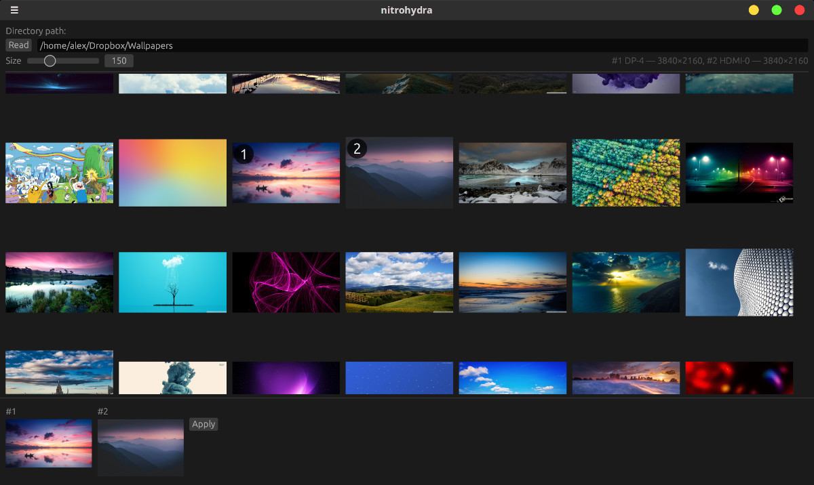

# nitrohydra

A multi-monitor wallpaper picker for X11 GNOME-based desktop environments.

> [!WARNING]
> **Tested only on Cinnamon DE. Should work on Gnome and MATE too.**

Browse a folder of images, select one wallpaper per monitor, and apply them instantly. Nitrohydra composes a single spanned image behind the scenes, so each monitor gets its own wallpaper even though Cinnamon only supports a single background URI.



## Features

- Thumbnail gallery with adjustable size and persistent disk cache
- Per-monitor wallpaper assignment (select #1 for left, #2 for right)
- Cover-resize: images are scaled and center-cropped to fill each monitor without letterboxing

## Usage

### GUI

Run `nitrohydra` with no arguments to start the graphical interface.

- **Click** an image to select it — first click sets monitor #1, second click sets monitor #2
- **Click** a new image when both are chosen to replace monitor #2
- **Click** a selected image when both are chosen to swap their order
- **Shift+click** an image to select it for both monitors at once

### CLI

Apply wallpapers directly from the command line without opening the GUI:

```bash
nitrohydra <image1> <image2>
```

Images are assigned to monitors left-to-right. For example:

```bash
nitrohydra ~/wallpapers/forest.jpg ~/wallpapers/mountain.jpg
```

Use `nitrohydra --help` for a quick usage summary.

## Requirements

- `xrandr` — used to detect connected monitors and their resolutions
- `gsettings` — used to apply the composed wallpaper via GNOME/Cinnamon settings

Both should be pre-installed on most GNOME-based desktops.

## Building from source

Requires Rust 2024 edition (1.85+).

```bash
git clone https://github.com/alexamy/nitrohydra.git
cd nitrohydra
cargo build --release
./target/release/nitrohydra
```

## Release

```
git commit -am "release: 0.2.0"
git tag "v0.2.0"
git push
git push --tags
```

## Contributing

Contributions are welcome!

## Built with ❤️

This project was built by a human and [Claude Code](https://claude.com/claude-code) working together.
